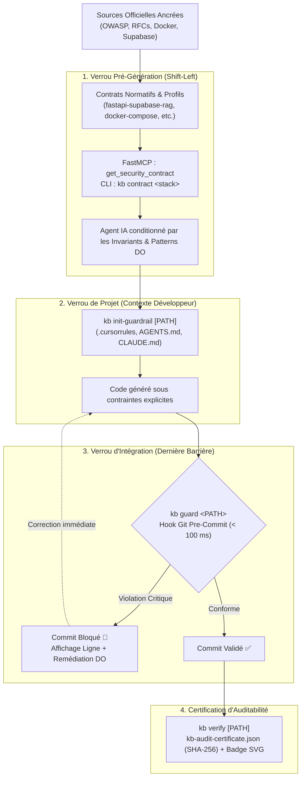

# Engineering Knowledge Base (`kb`)

### *Verified Engineering Knowledge & Policy Enforcement for AI-Assisted Software Development*

[](https://github.com/Alpha2-far/engineering-kb/actions/workflows/ci.yml)


---

## 🧭 Ce qu'est `kb` aujourd'hui

**`kb`** est une couche d'infrastructure logicielle qui transforme des standards d'ingénierie officiels et vérifiés en **contraintes opérationnelles exécutables et opposables** (*policy enforcement*) pour les développeurs et les agents de code IA (Claude Code, Cursor, Antigravity, Codex, GitHub Copilot).

Dans un cycle de développement assisté par IA, le piège le plus coûteux réside dans l'illusion de conformité : un modèle de langage génère facilement du code qui s'exécute sans erreur de syntaxe, mais qui enfreint silencieusement les règles architecturales élémentaires (montage de sockets Docker en root, cookies de session sans attribut SameSite, contournement d'isolation multi-tenant après recherche vectorielle, signatures JWT non imposées par le serveur).

Pour répondre à ce défi, `kb` ne se contente pas de stocker de la documentation : il applique une **doctrine de défense en profondeur** articulée autour de trois verrous temporels :
1. **Informer l'agent avant génération** via des contrats de sécurité formels et FastMCP.
2. **Guider le développement** en injectant des directives normatives délimitées dans l'environnement de l'agent.
3. **Bloquer mécaniquement les régressions** avant intégration via un garde-fou git pré-commit ultra-rapide (< 100 ms).

---

## 📐 L'Évolution Architecturale : De la Connaissance à l'Enforcement

`kb` n'est pas une simple collection de documents à laquelle un scanner de sécurité aurait été greffé. Le système a été conçu selon une trajectoire d'ingénierie incrémentale et cohérente, où chaque couche renforce le niveau de confiance de la suivante :

```text
1. Knowledge Base
   └─ Ingestion et archivage de sources d'ingénierie autoritaires (OWASP, RFCs, NIST, CIS, docs officielles).
           ↓
2. Verified Engineering Knowledge
   └─ Grounding Judge déterministe : ancrage textuel obligatoire (seuil ≥ 85 %) garantissant 0 hallucination.
           ↓
3. Agent-Accessible Intelligence
   └─ Serveur FastMCP natif & recherche sémantique : patterns DO / DON'T et contrats de stack prêts à l'emploi.
           ↓
4. Mechanical Code Auditing
   └─ Audit statique in-memory & moteur multi-fichiers tri-state (matière / sans occurrence / hors-périmètre).
           ↓
5. Development-Time Enforcement
   └─ Verrous actifs : garde-fous de projet délimités et hook git pré-commit bloquant les régressions critiques.
```

### Le changement de paradigme fondamental

Au départ, le système répondait à la question :
> *« Quelle règle d'ingénierie dois-je appliquer, et quelle est sa source officielle ? »*

L'architecture actuelle répond désormais à une exigence de production supérieure :
> *« Comment garantir que les contraintes d'ingénierie soient connues de l'agent avant qu'il n'écrive, respectées pendant la génération, et vérifiées mécaniquement avant que le code ne puisse être intégré au dépôt ? »*

---

## 🔒 Les Trois Verrous d'Enforcement (Défense en Profondeur)

Plutôt qu'un contrôle unique et tardif, `kb` positionne des points de contrôle à chaque moment charnière du cycle de conception :



### 1. Avant Génération : Les Contrats de Sécurité (`get_security_contract` & `kb contract`)
L'agent consulte le contrat de sécurité applicable à la stack cible dès l'initialisation de sa tâche. Le contrat lui fournit les 3 à 5 invariants non négociables, la checklist d'attestation pré-codage et les patterns de code sécurisés (DO) de référence.

### 2. Pendant le Développement : Les Guardrails de Projet (`kb init-guardrail`)
La commande `kb init-guardrail` injecte de façon **idempotente et délimitée** (`<!-- KB-SECURITY-GUARDRAIL-START -->` ... `<!-- KB-SECURITY-GUARDRAIL-END -->`) les directives de sécurité obligatoires dans les configurations d'agents détectées (`.cursorrules`, `AGENTS.md`, `CLAUDE.md`, `.github/copilot-instructions.md`). Les règles antérieures du développeur ne sont jamais altérées.

### 3. Avant Intégration : Le Garde-Fou Git Pré-Commit (`kb guard`)
Dernière ligne de défense, `kb guard` analyse les modifications indexées (`git add`) via `git show :<path>` en **moins de 100 ms**. Si une violation de sévérité critique ou haute subsiste, le commit est bloqué mécaniquement avec indication précise de la ligne fautive et affichage immédiat du pattern DO de remédiation.

---

## 🛠️ Exemple Concret : Neutraliser une Faille Silencieuse

### Scénario : Génération d'une infrastructure Docker & Backend FastAPI

Un agent IA reçoit la directive : *« Configure un conteneur d'outillage Docker et configure la session utilisateur en FastAPI. »*

#### ❌ Sans KB (Approche non encadrée)
L'agent produit un code qui fonctionne immédiatement :
```yaml
# docker-compose.yml
services:
  agent-runner:
    image: alpine
    volumes:
      - /var/run/docker.sock:/var/run/docker.sock  # ⚠️ Faille critique : accès root total sur l'hôte
```
```python
# auth.py
response.set_cookie(key="session", value=token, httponly=True)  # ⚠️ Faille haute : absence de SameSite & Secure
```
*Le développeur teste le service : tout démarre, les requêtes passent, l'application fonctionne. La faille d'escalade de privilèges et la vulnérabilité CSRF entrent silencieusement en production.*

#### ✅ Avec KB (Architecture sous contraintes)
1. **Consultation Pré-Codage** : L'agent appelle `get_security_contract("docker-compose")`. L'invariant normatif lui interdit explicitement l'accès au socket hôte et lui impose un utilisateur non-root.
2. **Guardrail de Projet** : `AGENTS.md` rappelle à Cursor et Claude Code l'obligation de paramétrer explicitement `samesite="lax"` ou `"strict"`.
3. **Filet de Sécurité Git (`kb guard`)** : Si par mégarde une régression critique est introduite, le hook pre-commit intercepte l'opération instantanément :

```text
🛑 KB Guard : Commit Bloqué !
1 violation critique de sécurité interceptée en 48.9 ms.

[CRITICAL] Ne jamais monter le socket Docker de l'hote dans un conteneur (docker-compose/mount-docker-socket)
  Fichier : docker-compose.yml:5 -> - /var/run/docker.sock:/var/run/docker.sock
  Pourquoi : Monter docker.sock donne un controle root direct sur l'hote.
  💡 Pattern Sécurisé Recommandé (DO) :
  Exposer une API dédiée avec mTLS ou orchestrer via un agent distant non privilégié.
```
Le commit est rejeté tant que le pattern conforme n'est pas appliqué.

---

## 🚀 Démarrage Rapide

### 1. Zero-Config via `uvx` (Sans clonage préalable)

`kb` est packagé pour une exécution immédiate sans dépendance globale :

```bash
# Lancer le serveur FastMCP en 1 commande
uvx --from git+https://github.com/Alpha2-far/engineering-kb.git kb mcp

# Inspecter les contrats de sécurité normatifs
uvx --from git+https://github.com/Alpha2-far/engineering-kb.git kb contract --list

# Installer le hook git pré-commit dans votre projet
uvx --from git+https://github.com/Alpha2-far/engineering-kb.git kb guard --install-hook
```

### 2. Configuration MCP pour votre Environnement IA

Des presets complets sont mis à disposition dans le répertoire [`presets/`](presets/) :

#### Claude Code (CLI)
```bash
claude mcp add kb-security uvx --from git+https://github.com/Alpha2-far/engineering-kb.git kb mcp
```

#### Cursor (`.cursor/mcp.json` ou `~/.cursor/mcp.json`)
```json
{
  "mcpServers": {
    "kb-security": {
      "command": "uvx",
      "args": ["--from", "git+https://github.com/Alpha2-far/engineering-kb.git", "kb", "mcp"]
    }
  }
}
```

#### Google Antigravity IDE (`mcp_config.json`)
```json
{
  "mcpServers": {
    "kb-security": {
      "command": "uvx",
      "args": ["--from", "git+https://github.com/Alpha2-far/engineering-kb.git", "kb", "mcp"]
    }
  }
}
```

#### Claude Desktop (`claude_desktop_config.json`)
```json
{
  "mcpServers": {
    "kb-security": {
      "command": "uvx",
      "args": ["--from", "git+https://github.com/Alpha2-far/engineering-kb.git", "kb", "mcp"]
    }
  }
}
```

---

## 🧩 Catalogue des Outils FastMCP

Le serveur FastMCP natif expose 4 points d'entrée proactifs pour assister les modèles de langage :

| Outil MCP | Rôle dans le workflow | Paramètres clés | Sortie |
|---|---|---|---|
| `get_security_contract` | **Shift-Left Pré-Codage** : charge les invariants et checklist d'une stack | `stack="fastapi-supabase-rag"` | Contrat Markdown avec invariants absolus et patterns DO |
| `resolve_security_topic` | Mappe une intention naturelle vers les règles normatives applicables | `topic="JWT FastAPI"`, `framework="fastapi"` | Topic structuré + IDs de règles prioritaires |
| `get_security_rules` | Fiches condensées avec justifications et patterns DO / DON'T | `rule_ids=["..."]` ou `topic="..."` | Markdown compact pour injection dans le contexte |
| `audit_code_snippet` | **Auto-remédiation** : audit statique en mémoire d'un extrait | `code="...", filename="main.py"` | Verdict (`clean: bool`), liste d'infractions, remédiation |

---

## 🏛️ Le Moteur Historique : Sources Canoniques & Grounding Judge

La robustesse de `kb` repose sur un principe immuable : **aucune règle n'est inventée ni paraphrasée sans preuve.**

```text
Registre Officiel (95 sources)
         ↓ (Git sparse clone / HTTP direct — Coût 0)
Archive Locale brute (raw/)
         ↓
Grounding Judge (uv run kb validate)
         ├─ Vérification mathématique par Levenshtein / ancre
         ├─ Seuil strict ≥ 85 % d'ancrage textuel
         └─ Rejet immédiat si la citation n'existe pas dans la source
         ↓
Règles Compilées & Profils Spécialisés (packs/)
```

### Registre des 95 Sources Officielles
- **Sécurité Applicative & Auth** : OWASP ASVS v4.0.3, OWASP Top 10, OWASP Cheatsheet Series, RFC 6749 (OAuth2), RFC 7519 (JWT), RFC 8446 (TLS 1.3), NIST SP 800-63B.
- **Conteneurs & Cloud** : CIS Docker Benchmark v1.6.0, CIS Kubernetes Benchmark v1.8.0, Docker Security Best Practices.
- **IA & Systèmes RAG** : OWASP Top 10 for LLM Applications v2.0, Supabase Hardening Guides, pgvector Documentation.
- **Frameworks** : Documentation officielle FastAPI, Next.js, Express, PostgreSQL.

### Le Principe Tri-State de l'Audit Engine
Lorsqu'un audit de code est exécuté (`kb audit` ou `kb verify`), le moteur distingue rigoureusement 3 états :

| État | Définition | Signification technique |
|---|---|---|
| **Règle avec matière** | Présence d'un motif suspect (`grep`) ou absence d'une directive obligatoire (`absent`) | Zone à inspecter ou corriger impérativement |
| **Sans occurrence** | Fichiers du périmètre analysés, aucun motif vulnérable détecté | Conforme sur le périmètre évalué |
| **Hors-périmètre** | Aucun fichier du projet ne correspond aux motifs de la règle (ex: pas de Dockerfile) | **Non évalué** — ne sera jamais qualifié faussement de « conforme » |

---

## 💻 Référence Complète de la CLI (`kb`)

```bash
# ------------------------------------------------------------------------------
# 1. ENFORCEMENT & GUARDRAILS (Cycle de Dev)
# ------------------------------------------------------------------------------
kb init-guardrail [PATH]           # Injecte les directives dans .cursorrules, AGENTS.md, CLAUDE.md
kb init-guardrail . --stack <id>   # Injecte les invariants d'une stack technologique
kb init-guardrail . --check        # Vérifie si les guardrails sont présents et actifs (code 0/1)

kb guard [PATH]                    # Analyse instantanée (< 100 ms) des fichiers git staged
kb guard --install-hook            # Installe le hook bloquant .git/hooks/pre-commit
kb guard --all                     # Analyse tous les fichiers modifiés de l'arbre de travail

kb verify [PATH]                   # Émet le certificat d'auditabilité officiel kb-audit-certificate.json
kb verify . --badge                # Génère en plus le badge vectoriel SVG autonome (kb-badge.svg)

# ------------------------------------------------------------------------------
# 2. EXPLORATION & CONTRATS
# ------------------------------------------------------------------------------
kb contract --list                 # Liste l'ensemble des contrats de sécurité disponibles
kb contract <stack-id>             # Affiche le détail complet d'un contrat en console
kb search "<requête>"              # Recherche sémantique par intention technique ou technologie

# ------------------------------------------------------------------------------
# 3. AUDIT MULTI-FICHIERS PAR PROFIL
# ------------------------------------------------------------------------------
kb audit saas /path/to/project     # Profil SaaS web CRUD (48 règles)
kb audit ai-rag /path/to/rag-app   # Profil Systèmes IA, RAG et vecteurs (43 règles)
kb audit api /path/to/service      # Profil Microservices et APIs sans front (42 règles)
kb audit cli /path/to/script       # Profil Outils CLI et scripts d'automatisation (17 règles)

# ------------------------------------------------------------------------------
# 4. GESTION DE LA KNOWLEDGE BASE
# ------------------------------------------------------------------------------
kb validate                        # Exécute le Grounding Judge (contrôle d'ancrage strict)
kb compile                         # Compile les règles validées dans les profils packs/
kb mcp                             # Démarre le serveur FastMCP natif (transport stdio)
```

---

## 🧪 Tests & Rigueur d'Ingénierie

Le projet est couvert par **94 tests automatisés** (unitaires, intégration MCP, analyse git et simulation d'agents) exécutés sur chaque pull request via GitHub Actions :

```bash
# Lancement de la suite complète
uv run pytest -v
```

Les tests valident en particulier :
- L'ancrage textuel exact contre les documents sources réels (`test_ground.py`).
- Le scoring d'intention et la recherche sémantique pondérée (`test_search.py`).
- L'exécution du serveur FastMCP et les appels asynchrones d'outils (`test_mcp.py`).
- Les contrats de sécurité et la résolution d'alias (`test_contracts.py`).
- L'injection idempotente et la non-altération du code utilisateur (`test_guardrail_cli.py`).
- L'interception mécanique des violations git sous les 100 ms et la certification SHA-256 (`test_guard_and_certificate.py`).
- La chaîne d'auto-remédiation de bout en bout (`test_e2e_agent.py`).

---

## 📁 Structure du Répertoire

```text
kb/
├── .github/              # Workflows CI (tests pytest, validation d'ancrage, compilation)
├── packs/                # Sorties compilées (profils, catégories JSON et index)
│   ├── by-category/      # Règles indexées par domaine (app-security, devops, database, etc.)
│   └── profiles/         # Profils compilés (saas.json, ai-rag.json, api.json, etc.)
├── presets/              # Fichiers de configuration client MCP prêts à copier (Cursor, Claude, etc.)
├── rules/                # Définitions YAML des 51 règles normatives et citations officielles
├── sources/              # Registre des 95 sources officielles autorisées (registry.yaml)
├── src/kb/               # Moteur d'ingénierie et d'enforcement
│   ├── audit.py          # Moteur d'audit statique et mécanique tri-state
│   ├── certificate.py    # Générateur de certificats SHA-256 et badges SVG
│   ├── cli.py            # Interface CLI Typer & Rich
│   ├── contracts.py      # Définition et résolution des contrats de stack normatifs
│   ├── guard.py          # Analyseur git pre-commit ultra-rapide (< 100 ms)
│   ├── guardrail.py      # Moteur d'injection délimitée multi-agents (.cursorrules, AGENTS.md, etc.)
│   ├── schema.py         # Modèles Pydantic stricts (Rule, Contract, Certificate, Findings)
│   ├── search.py         # Moteur de recherche sémantique pondéré
│   └── server.py         # Serveur FastMCP proactif natif
└── tests/                # Suite de 94 tests pytest automatisés
```

---

## 🤝 Contribution & Éthique de Preuve

Les contributions de nouvelles règles ou sources officielles sont encouragées via [CONTRIBUTING.md](CONTRIBUTING.md).

Toute contribution doit se conformer au principe fondateur du projet : **pas d'affirmation sans source officielle archivée et vérifiable par le Grounding Judge.**

---

## 📄 Licence

Ce projet est sous licence **MIT** — voir le fichier [LICENSE](LICENSE) pour plus de détails.
