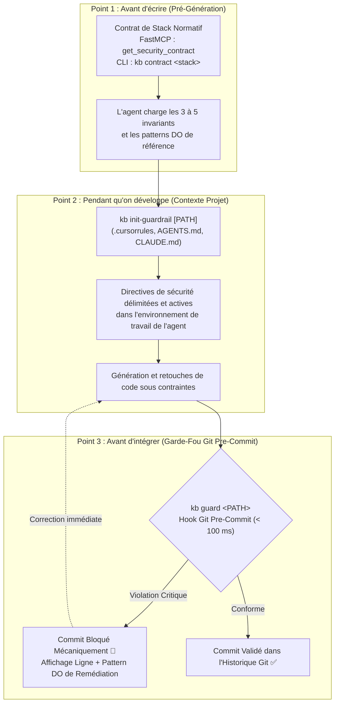

# Engineering Knowledge Base (`kb`)

### *Verified Engineering Knowledge & Development-Time Enforcement for AI-Assisted Software Engineering*

[](https://github.com/Alpha2-far/engineering-kb/actions/workflows/ci.yml)


---

## 1. Introduction : De la Base de Connaissances à la Couche d'Enforcement

`kb` est né d'un constat simple : la documentation d'ingénierie logicielle (standards OWASP, RFCs, guides CIS, spécifications officielles) est riche, mais dispersée et rarement exploitable directement au moment où le code est écrit. Le projet a donc débuté comme une **Engineering Knowledge Base** rigoureuse, collectant et vérifiant les meilleures pratiques de conception logicielle.

Cependant, avec l'émergence des agents de code autonomes (Claude Code, Cursor, Codex, Antigravity, GitHub Copilot), la nature du problème a changé d'échelle :
> **Le logiciel généré par IA peut être parfaitement fonctionnel en apparence — démarrer sans erreur de syntaxe et passer des tests unitaires basiques — tout en violant silencieusement des contraintes d'ingénierie et de sécurité majeures.**

Monter le socket Docker de l'hôte dans un conteneur d'outillage (`/var/run/docker.sock`), omettre l'attribut `SameSite` sur un cookie de session, ne pas imposer explicitement l'algorithme de vérification d'un JWT côté serveur, ou omettre le filtre de tenant avant une requête vectorielle pgvector sont des erreurs fréquentes que les modèles de langage commettent couramment lorsqu'ils ne sont pas explicitement contraints. Le phénomène dit de *vibe coding* n'est qu'une manifestation visible de cette rupture entre l'illusion de fonctionnement et la rigueur d'ingénierie.

Pour répondre à ce défi, `kb` a progressivement évolué : d'une base de documentation passive, le système est devenu une **couche de vérification et d'enforcement pour le développement assisté par IA**. Il ne se contente plus de répondre aux requêtes : il conditionne l'agent avant génération, inscrit les exigences au cœur du projet, et fournit un garde-fou git capable d'intercepter les régressions critiques avant leur intégration.

---

## 2. La Trajectoire Technologique : Les 5 Paliers de Confiance

L'architecture actuelle de `kb` est l'aboutissement d'une progression technologique délibérée, où chaque palier s'appuie sur la solidité du précédent :

```text
1. Documentation & Knowledge
   └─ Ingestion et archivage de 95 sources d'ingénierie officielles (OWASP, RFCs, NIST, CIS, docs frameworks).
           ↓
2. Verified Engineering Knowledge
   └─ Grounding Judge déterministe : validation mathématique de chaque citation (seuil ≥ 85 %) garantissant des règles fondées.
           ↓
3. Agentic Intelligence
   └─ Interface FastMCP & recherche sémantique : patterns DO / DON'T et contrats de stack directement consommables par les LLMs.
           ↓
4. Mechanical Code Auditing
   └─ Analyse statique in-memory & moteur multi-fichiers tri-state distinguant l'occurrence, l'absence et le hors-périmètre.
           ↓
5. Development-Time Enforcement
   └─ Points de contrôle actifs : directives de projet délimitées et garde-fou git pré-commit (< 100 ms) bloquant le commit.
```

Cette trajectoire reflète un changement de posture fondamental :
- **Au début, `kb` répondait à** : *« Quelle règle d'ingénierie dois-je appliquer, et quelle est sa source ? »*
- **Aujourd'hui, `kb` répond à** : *« Comment faire en sorte que les contraintes d'ingénierie pertinentes soient connues par l'agent, appliquées pendant la génération et vérifiées mécaniquement avant que le code ne puisse être intégré au dépôt ? »*

---

## 3. Le Socle Fondamental : Une Connaissance Ancrée et Prouvable

Le passage à l'enforcement ne dilue pas l'exigence documentaire originelle : il la rend indispensable. **L'enforcement ne peut pas reposer sur des opinions ou des synthèses floues générées à la volée par un LLM.** Pour être légitime et opposable à un développeur ou à un agent, chaque contrainte doit découler d'une règle formellement ancrée dans un standard officiel.

```text
Sources Officielles (95 dépôts / docs)
           ↓ (Acquisition Git sparse clone / HTTP à coût 0)
Archive Locale brute (raw/ — gitignorée)
           ↓
Grounding Judge (uv run kb validate)
   ├─ Calcul de distance de Levenshtein entre citation déclarée et texte source brut
   ├─ Seuil strict d'ancrage textuel ≥ 85 %
   └─ Rejet automatique : aucune règle n'est compilée sans preuve matérielle
           ↓
51 Règles Normatives Actives (0 rejet d'ancrage)
           ↓
Contrats de Sécurité & Profils d'Enforcement
```

### La Chaîne de Confiance
Toute contrainte imposée par `kb` obéit à la chaîne :
**Source officielle → Archive locale → Citation exacte → Règle avec Do/Don't → Validation par le Grounding Judge → Connaissance exploitable → Enforcement.**

Le *Grounding Judge* ne prétend pas empêcher un modèle de langage d'halluciner de manière générale : sa garantie technique est spécifique et mesurable. Il assure que **chaque règle inscrite au catalogue s'appuie sur une citation textuelle vérifiée dans l'archive officielle selon son critère de validation**.

---

## 4. L'Interface Agentique : Le Rôle de FastMCP

Le protocole **Model Context Protocol (MCP)** constitue l'interface d'accès agentique à la connaissance et aux capacités de vérification de `kb`. Ce n'est pas le produit lui-même, mais la passerelle native permettant aux agents (Cursor, Claude Code, Antigravity, Claude Desktop) d'interagir avec le moteur via le transport standard `stdio`.

### Les 4 Outils Exposés aux Agents

| Outil FastMCP | Rôle dans le cycle de vie | Entrée typique | Données restituées |
|---|---|---|---|
| `get_security_contract` | **Amont (Pré-Codage)** : charge les invariants et la checklist d'une stack | `stack="fastapi-supabase-rag"` | Contrat Markdown avec invariants absolus et patterns DO |
| `resolve_security_topic` | Mappe une intention naturelle vers les règles normatives applicables | `topic="JWT FastAPI"` | Topic résolu + liste ordonnée des IDs de règles |
| `get_security_rules` | Fiches de sécurité compactes avec justifications et patterns DO / DON'T | `rule_ids=["..."]` | Markdown condensé optimisé pour le contexte du LLM |
| `audit_code_snippet` | **Audit en Mémoire** : évalue un extrait généré avant écriture sur disque | `code="...", filename="auth.py"` | Verdict (`clean: bool`), infractions détectées, remédiation |

---

## 5. De l'Observation à l'Action : Distinguer Audit et Enforcement

Pour comprendre la structure des contrôles de `kb`, il est essentiel de distinguer deux postures d'ingénierie :

- **L'Audit (`kb audit`, `audit_code_snippet`)** :
  > *« Voici ce que j'ai observé dans le code. »*  
  C'est un mécanisme d'inspection statique qui cartographie le code existant. Il classe les constats selon le principe tri-state (*avec matière*, *sans occurrence*, *hors-périmètre*) pour informer l'ingénieur ou l'agent sans interrompre directement les flux d'exécution.

- **L'Enforcement (`kb init-guardrail`, `kb guard`)** :
  > *« Cette contrainte est active, et cette violation détectée bloque l'étape suivante du workflow. »*  
  C'est un mécanisme d'action qui intervient mécaniquement dans le cycle de développement pour empêcher qu'une régression critique ne soit validée ou intégrée.

---

## 6. Les Trois Verrous Temporels d'Enforcement (Défense en Profondeur)

L'enforcement de `kb` n'est pas une suite d'outils disparates, mais une combinaison de **trois points de contrôle temporels** répartis le long du cycle de développement :



### Pourquoi ces trois positions temporelles ?
1. **Avant d'écrire (Point 1)** : Réduit drastiquement les erreurs à la source en fournissant le cadre architectural (invariants et patterns DO) à l'agent avant qu'il ne formule sa réponse.
2. **Pendant qu'on développe (Point 2)** : Maintient les contraintes vivantes dans l'espace de contexte du projet via des blocs idempotents délimités (`<!-- KB-SECURITY-GUARDRAIL-START -->` ... `<!-- KB-SECURITY-GUARDRAIL-END -->`), sans jamais altérer les instructions personnelles du développeur.
3. **Avant d'intégrer (Point 3)** : Constitue la dernière barrière mécanique. `kb guard` inspecte fidèlement ce qui est indexé dans git (`git show :<path>`) en **moins de 100 ms**. Si une infraction critique ou haute est présente, le commit échoue avec code de sortie 1.

---

## 7. La Couche de Certification d'Auditabilité (`kb verify`)

Là où les trois verrous précédents agissent comme des contrôles opérationnels bloquants, **`kb verify`** intervient comme une **couche de certification et d'attestation formelle**.

```bash
# Audite le projet et émet les artefacts d'auditabilité
kb verify . --profile saas --badge
```

### Ce que produit `kb verify` :
1. **`kb-audit-certificate.json`** : Un certificat d'auditabilité formel scellé par une **empreinte cryptographique SHA-256** calculée sur le digest des résultats d'évaluation, le commit git actif, le profil appliqué et la liste des sources d'autorité citées.
2. **`KB-AUDIT-CERTIFICATE.md`** : Un rapport lisible pour les comités d'architecture, revues de code ou livrables clients.
3. **`kb-badge.svg`** : Un badge vectoriel autonome aux couleurs de la doctrine de confiance (Évergreen `#2E4A3F` pour *Verified 100%*).

`kb verify` ne remplace pas les tests ou les revues de code manuelles : il atteste de manière vérifiable et non répudiable qu'une base de code a été confrontée avec succès aux règles normatives du profil choisi.

---

## 8. Étude de Cas : Neutraliser les Violations Silencieuses

### Le Scénario : Outillage Docker & Authentification FastAPI

Un développeur demande à un agent de code : *« Ajoute un conteneur d'outillage dans docker-compose et configure la session utilisateur dans le backend FastAPI. »*

#### ❌ Sans KB (Fonctionnel mais vulnérable)
L'agent propose un code qui s'exécute immédiatement sans la moindre erreur :
```yaml
# docker-compose.yml
services:
  tooling:
    image: alpine
    volumes:
      - /var/run/docker.sock:/var/run/docker.sock  # ⚠️ Risque critique : accès root direct à l'hôte
```
```python
# auth.py
response.set_cookie(key="session_id", value=token, httponly=True)  # ⚠️ Risque haut : pas de SameSite ni Secure
```
*Le développeur démarre le conteneur, teste le login, tout fonctionne. Deux vulnérabilités architecturales sévères entrent dans la base de code sans être détectées par les tests unitaires fonctionnels.*

#### ✅ Avec KB (Sous contrôle d'enforcement)
1. **Amont** : L'agent interroge `get_security_contract("docker-compose")`. Le contrat lui interdit explicitement le montage du socket hôte et lui prescrit un utilisateur non-root.
2. **Contexte projet** : `CLAUDE.md` et `AGENTS.md` (initialisés via `kb init-guardrail`) imposent l'attestation des cookies `SameSite=Lax/Strict`.
3. **Dernière barrière mécanique** : Si malgré tout un extrait fautif est indexé, `git commit` déclenche immédiatement `kb guard` :

```text
🛑 KB Guard : Commit Bloqué !
1 violation critique de sécurité interceptée en 38.4 ms.

[CRITICAL] Ne jamais monter le socket Docker de l'hote dans un conteneur (docker-compose/mount-docker-socket)
  Fichier : docker-compose.yml:5 -> - /var/run/docker.sock:/var/run/docker.sock
  Pourquoi : Monter docker.sock donne un controle root direct sur l'hote.
  💡 Pattern Sécurisé Recommandé (DO) :
  Exposer une API dédiée avec mTLS ou orchestrer via un agent distant non privilégié.
```
Le commit est interrompu tant que le pattern conforme n'est pas appliqué.

---

## 9. Prise en Main & Intégration

### 1. Exécution Immédiate via `uvx` (Zero-Config)

```bash
# Démarrer le serveur FastMCP (transport stdio)
uvx --from git+https://github.com/Alpha2-far/engineering-kb.git kb mcp

# Inspecter les contrats normatifs disponibles
uvx --from git+https://github.com/Alpha2-far/engineering-kb.git kb contract --list

# Installer le hook git pré-commit dans le dépôt courant
uvx --from git+https://github.com/Alpha2-far/engineering-kb.git kb guard --install-hook
```

### 2. Configuration MCP des Clients IA

Les presets complets sont disponibles dans [`presets/`](presets/) :

#### Claude Code (CLI)
```bash
claude mcp add kb-security uvx --from git+https://github.com/Alpha2-far/engineering-kb.git kb mcp
```

#### Cursor (`.cursor/mcp.json` ou `~/.cursor/mcp.json`)
```json
{
  "mcpServers": {
    "kb-security": {
      "command": "uvx",
      "args": ["--from", "git+https://github.com/Alpha2-far/engineering-kb.git", "kb", "mcp"]
    }
  }
}
```

#### Antigravity IDE (`mcp_config.json`)
```json
{
  "mcpServers": {
    "kb-security": {
      "command": "uvx",
      "args": ["--from", "git+https://github.com/Alpha2-far/engineering-kb.git", "kb", "mcp"]
    }
  }
}
```

---

## 10. Moteur Tri-State & Profils d'Audit

Lorsqu'un audit statique est exécuté (`kb audit`), le moteur écarte rigoureusement le risque de « faux-calme » en distinguant trois états pour chaque règle :

| État | Définition technique | Interprétation rigoureuse |
|---|---|---|
| **Règle avec matière** | Motif vulnérable identifié (`grep`) ou motif obligatoire absent (`absent`) | Infraction avérée ou point d'attention immédiat |
| **Sans occurrence** | Fichiers visés analysés, aucun motif suspect relevé | Conforme sur le périmètre inspecté |
| **Hors-périmètre** | Aucun fichier du projet ne correspond au glob (ex: pas de Dockerfile) | **Non évalué** — ne sera jamais qualifié faussement de « conforme » |

### Les 6 Profils Compilés
- `saas` : Applications web CRUD, architectures multi-tenants, sessions (48 règles).
- `ai-rag` : Systèmes d'IA générative, bases vectorielles, injections de prompt (43 règles).
- `api` : Microservices et architectures API REST/GraphQL (42 règles).
- `pipeline` : Traitements batch et pipelines de données (19 règles).
- `cli` : Outils en ligne de commande et scripts d'administration (17 règles).
- `static-site` : Sites statiques et interfaces web légères (8 règles).

---

## 11. Référence Complète de la CLI (`kb`)

```bash
# --- Enforcement & Contrôles de Développement ---
kb init-guardrail [PATH]           # Injecte les directives dans .cursorrules, AGENTS.md, CLAUDE.md
kb init-guardrail . --stack <id>   # Injecte les invariants d'une stack technologique spécifique
kb init-guardrail . --check        # Vérifie si les guardrails sont en place et actifs (code 0/1)

kb guard [PATH]                    # Analyse instantanée (< 100 ms) des fichiers git staged
kb guard --install-hook            # Installe le hook bloquant .git/hooks/pre-commit
kb guard --all                     # Analyse tous les fichiers modifiés du répertoire de travail

kb verify [PATH]                   # Émet le certificat d'auditabilité officiel kb-audit-certificate.json
kb verify . --badge                # Génère en plus le badge vectoriel SVG autonome (kb-badge.svg)

# --- Contrats Normatifs & Recherche ---
kb contract --list                 # Liste l'ensemble des contrats de sécurité disponibles
kb contract <stack-id>             # Affiche le détail complet d'un contrat en console
kb search "<requête>"              # Recherche sémantique par intention technique ou technologie

# --- Audit Statique par Profil ---
kb audit saas /path/to/project     # Audit complet d'un projet web selon le profil saas
kb audit ai-rag /path/to/project   # Audit d'une architecture RAG selon le profil ai-rag

# --- Gestion de la Base de Connaissances ---
kb validate                        # Exécute le Grounding Judge (validation d'ancrage textuel)
kb compile                         # Compile les règles validées dans les profils packs/
kb mcp                             # Démarre le serveur FastMCP natif (transport stdio)
```

---

## 12. Assurance Qualité & Tests

Le projet est validé par une suite complète de **94 tests automatisés** exécutés sur chaque modification via GitHub Actions CI :

```bash
uv run pytest -v
```

Les tests garantissent la fiabilité des modules critiques :
- Ancrage des citations contre les sources officielles réelles (`test_ground.py`).
- Recherche sémantique pondérée et scoring d'intention (`test_search.py`).
- Outils et transport du serveur FastMCP (`test_mcp.py`).
- Résolution et intégrité des contrats de stack (`test_contracts.py`).
- Idempotence et préservation des directives développeur dans l'injection (`test_guardrail_cli.py`).
- Interception mécanique pré-commit sous les 100 ms et signature SHA-256 (`test_guard_and_certificate.py`).
- Scénario d'auto-remédiation d'agent de bout en bout (`test_e2e_agent.py`).

---

## 13. Structure du Répertoire

```text
kb/
├── .github/              # Workflows CI (tests pytest, validation d'ancrage, compilation)
├── packs/                # Sorties compilées (profils JSON et index de distribution)
│   ├── by-category/      # Règles indexées par domaine d'ingénierie
│   └── profiles/         # Profils compilés (saas.json, ai-rag.json, etc.)
├── presets/              # Fichiers de configuration client MCP prêts à copier (Cursor, Claude, etc.)
├── rules/                # Définitions YAML des 51 règles normatives et citations officielles
├── sources/              # Registre des 95 sources officielles autorisées (registry.yaml)
├── src/kb/               # Moteur d'ingénierie et d'enforcement
│   ├── audit.py          # Moteur d'audit statique et mécanique tri-state
│   ├── certificate.py    # Générateur de certificats SHA-256 et badges SVG
│   ├── cli.py            # Interface CLI Typer & Rich
│   ├── contracts.py      # Définition et résolution des contrats de stack normatifs
│   ├── guard.py          # Analyseur git pre-commit ultra-rapide (< 100 ms)
│   ├── guardrail.py      # Moteur d'injection délimitée multi-agents
│   ├── schema.py         # Modèles Pydantic stricts (Rule, Contract, Certificate, Findings)
│   ├── search.py         # Moteur de recherche sémantique pondéré
│   └── server.py         # Serveur FastMCP proactif natif
└── tests/                # Suite de 94 tests pytest automatisés
```

---

## 14. Contribution & Licence

Les contributions de nouvelles règles ou sources officielles sont les bienvenues via [CONTRIBUTING.md](CONTRIBUTING.md).

Toute proposition doit obligatoirement satisfaire à la doctrine de preuve du projet : **pas d'affirmation sans source officielle archivée et vérifiable mathématiquement par le Grounding Judge.**

Ce projet est sous licence **MIT** — voir le fichier [LICENSE](LICENSE) pour plus de détails.
