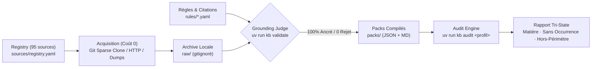

# Engineering Knowledge Base (`kb`)

[](https://github.com/Alpha2-far/engineering-kb/actions/workflows/ci.yml)


Base de connaissance d'ingénierie et moteur de repérage permettant à des **agents IA et ingénieurs** d'auditer et sécuriser du code selon les standards réels de l'industrie : sécurité applicative, authentification, bases de données, DevOps, architectures IA/RAG, APIs et conformité.

Chaque règle porte une **citation verbatim vérifiée dans un document officiel archivé** (OWASP, NIST, RFC, CIS, documentations officielles). Une règle dont la citation ne s'ancre pas mathématiquement dans l'archive est **rejetée automatiquement** par notre *Grounding Judge* (seuil strict >= 85 %).

---

## 🏛️ Architecture & Pipeline



---

## ⚡ Démarrage Rapide

Ce projet utilise [`uv`](https://docs.astral.sh/uv/) pour une gestion ultra-rapide des dépendances Python.

```bash
# 1. Cloner et installer les dépendances
git clone https://github.com/Alpha2-far/engineering-kb.git
cd engineering-kb
uv sync

# 2. Vérifier la connectivité des sources officielles
uv run kb doctor --tier 1

# 3. Acquérir les sources canoniques (coût 0 : git/HTTP)
uv run kb acquire --tier 1

# 4. Valider l'ancrage des citations et la non-duplication
uv run kb validate

# 5. Compiler les packs prêts pour les agents IA
uv run kb compile

# 6. Auditer un projet de code
uv run kb audit ai-rag /chemin/vers/mon-projet
```

> **Note sur `raw/` :** Le dossier `raw/` est volontairement **gitignoré** (volume + licences de rediffusion tierces). Sur un environnement neuf, `kb acquire` télécharge les sources canoniques pour alimenter le validateur d'ancrage.

---

## 💰 Principe de Coût : Zéro Dépense Inutile

| Rôle | Outil | Coût |
|---|---|---|
| **Trouver** les sources | Firecrawl (`kb discover`) | Quelques crédits réservés au HTML pur |
| **Récupérer** le texte | git / HTTP / dumps officiels | **0 crédit** |

La quasi-totalité des sources autoritaires (OWASP, Kubernetes, Docker, FastAPI, Supabase, RFCs...) sont des dépôts git publics. Un `git clone --filter=blob:none --sparse` extrait le texte source et le SHA de commit exact gratuitement. Firecrawl est strictement réservé aux documentations sans version git publique.

---

## 🔍 Les Trois Voies d'Utilisation

### 1. Auditer un Projet (CLI)

```bash
# Repérage interactif en console
uv run kb audit ai-rag /path/to/ai-service

# Sortie structurée JSON consommable par un agent IA ou pipeline CI
uv run kb audit saas /path/to/saas-app --json /tmp/audit-report.json
```

**Profils d'audit disponibles :**
- `ai-rag` : Systèmes IA générative, RAG, vecteurs, prompts.
- `saas` : SaaS CRUD, multi-tenant, backends web.
- `api` : Microservices et APIs REST/GraphQL sans front.
- `cli` : Outils en ligne de commande et scripts de production.
- `pipeline` : Traitements batch et flux de données.
- `static-site` : Sites statiques et frontends légers.

### 2. Le Moteur Tri-State (Zéro Faux-Calme)

L'audit distingue formellement trois états pour éviter les conclusions trompeuses :

| État | Définition | Interprétation |
|---|---|---|
| **Règle avec matière** | Des lignes précises ciblées par les motifs | « À examiner », **pas** nécessairement une faille |
| **Sans occurrence** | Évaluée sur les fichiers cibles, aucun motif suspect trouvé | Point vert légitime |
| **Hors-périmètre** | Aucun fichier du projet ne correspond aux globs de la règle | « Non évalué » — **jamais « conforme »** |

*Pourquoi c'est capital ?* Un projet sans Dockerfile ne « respecte » pas la règle de l'utilisateur non-root : elle ne s'applique tout simplement pas. Les confondre produirait un rapport affirmant la conformité d'une zone jamais inspectée.

### 3. Intégration Agents IA (Claude, Cursor, OpenAI, MCP)

Les agents IA peuvent directement consommer les packs compilés ou appeler `kb audit --json` :

```bash
# Consulter la vue globale humaine
open packs/RULES.md

# Filtrer par catégorie technique
cat packs/by-category/authentication.json

# Index de routage par technologie
cat packs/index.json
```

> **Économie de contexte :** Ne chargez pas un profil complet aveuglément (~40k tokens). Préférez appeler `kb audit --json`, qui n'extrait que les règles déclenchées et leurs lignes de code associées.

---

## 🧪 Tests & Assurance Qualité

Le projet intègre une suite de tests automatisés validant le portail d'ancrage (`ground.py`) et le moteur d'audit (`audit.py`) :

```bash
uv run pytest -v
```

Ces composants critiques sont testés unitairement car toute défaillance est par nature **silencieuse** : elles ne provoquent pas de crash, mais pourraient rejeter du travail valide ou accuser du code conforme.

---

## 📚 Structure du Répertoire

```text
kb/
├── .github/              # Actions CI (pytest, validate) & templates GitHub
├── packs/                # Sorties compilées (profils, catégories, RULES.md)
├── rules/                # Définitions YAML des règles et citations
│   ├── cli-tooling.yaml
│   ├── owasp-cheatsheets.yaml
│   ├── owasp-llm-top10.yaml
│   └── stack-supabase-fastapi.yaml
├── sources/              # Registre des 95 sources officielles autorisées
├── src/kb/               # Moteur Python (audit, acquire, validate, compile)
├── tests/                # Suite de tests pytest
├── ARCHITECTURE.md       # Architecture profonde et décisions d'ingénierie
├── CONTRIBUTING.md       # Guide de contribution pour nouvelles règles
├── EXTRACTION.md         # Méthodologie d'extraction normative
├── LICENSE               # Licence MIT
└── pyproject.toml        # Métadonnées et packaging hatchling / uv
```

---

## 🤝 Contribuer

Les contributions de nouvelles règles ou sources officielles sont les bienvenues ! Veuillez consulter le guide complet dans [CONTRIBUTING.md](CONTRIBUTING.md).

Toute proposition doit obligatoirement respecter la règle d'ancrage : **citation verbatim vérifiable dans un document archivé officiel**.

---

## 📄 Licence

Ce projet est sous licence **MIT** — voir le fichier [LICENSE](LICENSE) pour plus de détails.
